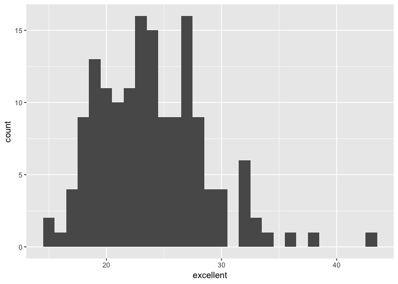

Homework\_2
================
Xinyi Lin
9/28/2018

Problem 1
=========

Read and clean data
-------------------

Before dealing with data, we need to load related packages and import data.

``` r
library(tidyverse)
```

    ## ── Attaching packages ─────────────────────────────────────────────────────────── tidyverse 1.2.1 ──

    ## ✔ ggplot2 3.0.0     ✔ purrr   0.2.5
    ## ✔ tibble  1.4.2     ✔ dplyr   0.7.6
    ## ✔ tidyr   0.8.1     ✔ stringr 1.3.1
    ## ✔ readr   1.1.1     ✔ forcats 0.3.0

    ## ── Conflicts ────────────────────────────────────────────────────────────── tidyverse_conflicts() ──
    ## ✖ dplyr::filter() masks stats::filter()
    ## ✖ dplyr::lag()    masks stats::lag()

``` r
NYC_subway_data = read_csv(file = "./data/NYC_Transit_Subway_Entrance_And_Exit_Data.csv")

NYC_subway_data = janitor::clean_names(NYC_subway_data)

head(NYC_subway_data)
```

    ## # A tibble: 6 x 32
    ##   division line  station_name station_latitude station_longitu… route1
    ##   <chr>    <chr> <chr>                   <dbl>            <dbl> <chr> 
    ## 1 BMT      4 Av… 25th St                  40.7            -74.0 R     
    ## 2 BMT      4 Av… 25th St                  40.7            -74.0 R     
    ## 3 BMT      4 Av… 36th St                  40.7            -74.0 N     
    ## 4 BMT      4 Av… 36th St                  40.7            -74.0 N     
    ## 5 BMT      4 Av… 36th St                  40.7            -74.0 N     
    ## 6 BMT      4 Av… 45th St                  40.6            -74.0 R     
    ## # ... with 26 more variables: route2 <chr>, route3 <chr>, route4 <chr>,
    ## #   route5 <chr>, route6 <chr>, route7 <chr>, route8 <int>, route9 <int>,
    ## #   route10 <int>, route11 <int>, entrance_type <chr>, entry <chr>,
    ## #   exit_only <chr>, vending <chr>, staffing <chr>, staff_hours <chr>,
    ## #   ada <lgl>, ada_notes <chr>, free_crossover <lgl>,
    ## #   north_south_street <chr>, east_west_street <chr>, corner <chr>,
    ## #   entrance_latitude <dbl>, entrance_longitude <dbl>,
    ## #   station_location <chr>, entrance_location <chr>

Then, we try to select the variables we interested and change the structure of the dataset so that it is easier to analyze.

``` r
NYC_subway_clean_data =
  gather(NYC_subway_data, key = route_number, value = route_name, route1:route11) %>% 
  separate(route_number, into = c("remove", "route_number"), sep = 5) %>%
  select(line, station_name, station_latitude, station_longitude, route_number, route_name, entry, entrance_type, vending, ada) %>% 
  mutate(entry = recode(entry, "YES" = TRUE, "NO" = FALSE))

head(NYC_subway_clean_data)
```

    ## # A tibble: 6 x 10
    ##   line  station_name station_latitude station_longitu… route_number
    ##   <chr> <chr>                   <dbl>            <dbl> <chr>       
    ## 1 4 Av… 25th St                  40.7            -74.0 1           
    ## 2 4 Av… 25th St                  40.7            -74.0 1           
    ## 3 4 Av… 36th St                  40.7            -74.0 1           
    ## 4 4 Av… 36th St                  40.7            -74.0 1           
    ## 5 4 Av… 36th St                  40.7            -74.0 1           
    ## 6 4 Av… 45th St                  40.6            -74.0 1           
    ## # ... with 5 more variables: route_name <chr>, entry <lgl>,
    ## #   entrance_type <chr>, vending <chr>, ada <lgl>

In the original dataset, there are 1868 observations and 32 variables. The variables including division and line of subway, name, latitude and longitude of stations, routes served, staff information and related information about entrance ane exit.

As `route 1` to `route 11` are same kind of variables, we can combine them to turn them and their values into new variables `route_number` and `route_name`. Besides, we only interested in information about station, routes, entrance and exit, we chose parts of variables for further analysis, including line, station, name, station latitude / longitude, routes served, entry, vending, entrance type and ADA. We also convert the entry variable from character (YES vs NO) to a logical variable.

Now the new dataset have 20548 observations and 10 variables and it is tidier.

Answer questions
----------------

### Question 1

There are 465 distinct stations which have different station names or lines in the dataset.

### Question 2

``` r
ada_stations = 
  filter(NYC_subway_data, ada == "TRUE") %>% 
  distinct(station_name, line) %>% 
  nrow()
```

We define that only those stations which with ADA are ADA compliant, in other word, we select stations with entrances/exits that ADA is TRUE. Based on this defination, there are 84 stations are ADA compliant.

### Question 3

As the observation in this dataset have either different entrance loation or different entrance type, we define each observation in this dataset as distinct entrance/exit, so the number of entrances/exits without vending is 183 and the number of entrances/exits without vending and allowed entrance is 69. The proportion of entrances/exits without vending allow entrance is 0.3770492.

### Question 4

``` r
Atrain_stations =
  filter(NYC_subway_clean_data, route_name == "A") %>% 
  distinct(line, station_name) %>% 
  nrow()
```

``` r
ada_Atrain_stations =
  filter(NYC_subway_clean_data, route_name == "A", ada == "TRUE") %>% 
  distinct(line, station_name) %>% 
  nrow()
```

There are 60 distinct stations serve the A train and 17 of them are ADA compliant.

Problem 2
=========

The Mr. Trash Wheel sheet
-------------------------

Read and clean data.

``` r
library(readxl)
MrTW_data = 
  read_excel(path = "./data/HealthyHarborWaterWheelTotals2018-7-28.xlsx", range = "A2:N338") %>% 
  janitor::clean_names() 

head(MrTW_data)
```

    ## # A tibble: 6 x 14
    ##   dumpster month  year date                weight_tons volume_cubic_ya…
    ##      <dbl> <chr> <dbl> <dttm>                    <dbl>            <dbl>
    ## 1        1 May    2014 2014-05-16 00:00:00        4.31               18
    ## 2        2 May    2014 2014-05-16 00:00:00        2.74               13
    ## 3        3 May    2014 2014-05-16 00:00:00        3.45               15
    ## 4        4 May    2014 2014-05-17 00:00:00        3.1                15
    ## 5        5 May    2014 2014-05-17 00:00:00        4.06               18
    ## 6        6 May    2014 2014-05-20 00:00:00        2.71               13
    ## # ... with 8 more variables: plastic_bottles <dbl>, polystyrene <dbl>,
    ## #   cigarette_butts <dbl>, glass_bottles <dbl>, grocery_bags <dbl>,
    ## #   chip_bags <dbl>, sports_balls <dbl>, homes_powered <dbl>

``` r
MrTW_clean_data = 
  filter(MrTW_data, !is.na(dumpster)) %>% 
  mutate(sports_balls = as.integer(round(sports_balls)))

head(MrTW_clean_data)
```

    ## # A tibble: 6 x 14
    ##   dumpster month  year date                weight_tons volume_cubic_ya…
    ##      <dbl> <chr> <dbl> <dttm>                    <dbl>            <dbl>
    ## 1        1 May    2014 2014-05-16 00:00:00        4.31               18
    ## 2        2 May    2014 2014-05-16 00:00:00        2.74               13
    ## 3        3 May    2014 2014-05-16 00:00:00        3.45               15
    ## 4        4 May    2014 2014-05-17 00:00:00        3.1                15
    ## 5        5 May    2014 2014-05-17 00:00:00        4.06               18
    ## 6        6 May    2014 2014-05-20 00:00:00        2.71               13
    ## # ... with 8 more variables: plastic_bottles <dbl>, polystyrene <dbl>,
    ## #   cigarette_butts <dbl>, glass_bottles <dbl>, grocery_bags <dbl>,
    ## #   chip_bags <dbl>, sports_balls <int>, homes_powered <dbl>

The 2016/2017 precipitation sheet
---------------------------------

Read and clean data.

``` r
precipitation_2016_data = 
  read_excel(path = "./data/HealthyHarborWaterWheelTotals2018-7-28.xlsx", 
                                     sheet = "2016 Precipitation", skip = 1) %>% 
  janitor::clean_names() 

precipitation_2017_data = 
  read_excel(path = "./data/HealthyHarborWaterWheelTotals2018-7-28.xlsx", 
                                     sheet = "2017 Precipitation", skip = 1) %>% 
  janitor::clean_names() 

precip_2016_clean_data = 
  filter(precipitation_2016_data, !is.na(month)) %>% 
  mutate(year = 2016) %>% 
  select(year, month, total)

head(precip_2016_clean_data)
```

    ## # A tibble: 6 x 3
    ##    year month total
    ##   <dbl> <dbl> <dbl>
    ## 1  2016     1  3.23
    ## 2  2016     2  5.32
    ## 3  2016     3  2.24
    ## 4  2016     4  1.78
    ## 5  2016     5  5.19
    ## 6  2016     6  3.2

``` r
precip_2017_clean_data = 
  filter(precipitation_2017_data, !is.na(month)) %>% 
  mutate(year = 2017) %>% 
  select(year, month, total)

head(precip_2017_clean_data)
```

    ## # A tibble: 6 x 3
    ##    year month total
    ##   <dbl> <dbl> <dbl>
    ## 1  2017     1  2.34
    ## 2  2017     2  1.46
    ## 3  2017     3  3.57
    ## 4  2017     4  3.99
    ## 5  2017     5  5.64
    ## 6  2017     6  1.4

Combine datasets and convert month to a character variable.

``` r
precipitation_clean_data = 
  bind_rows(precip_2016_clean_data, precip_2017_clean_data) %>% 
  mutate(month = month.abb[month])

head(precipitation_clean_data)
```

    ## # A tibble: 6 x 3
    ##    year month total
    ##   <dbl> <chr> <dbl>
    ## 1  2016 Jan    3.23
    ## 2  2016 Feb    5.32
    ## 3  2016 Mar    2.24
    ## 4  2016 Apr    1.78
    ## 5  2016 May    5.19
    ## 6  2016 Jun    3.2

Overall
-------

``` r
MrTW_2016_clean_data = filter(MrTW_clean_data, year == "2016") 
sports_balls_median = median(MrTW_2016_clean_data$sports_balls)
```

There are 285 observations and 14 variables in the `MrTW_clean_data` dataset. The key variables including `dumpster`, `data` and `homes_powered`. There are 24 observations and 3 variables in the `precipitation_clean_data` dataset. The key variables are `year`, `month` and `total`. Among them, 12 observations are from 2016, and 12 observations are from 2017. The total precipitation in 2017 is 32.93. The median number of sports balls in a dumpster in 2016 is 26.

Problem 3
=========

Load and clean data
-------------------

``` r
library(p8105.datasets)
data(brfss_smart2010)
```

``` r
brfss_clean_data = 
  janitor::clean_names(brfss_smart2010) %>% 
  filter(topic == "Overall Health") %>% 
  select(-c(class, topic, question, sample_size, confidence_limit_low:geo_location)) %>% 
  reshape::rename(c(locationabbr = "location_abbr", locationdesc = "location_desc"))

brfss_spread_data =
  spread(brfss_clean_data, key = response, value = data_value) %>% 
  janitor::clean_names() %>% 
  mutate(high_proportion = excellent + very_good)
```

Answer questions
----------------

### Question 1

``` r
states_observations = 
  brfss_spread_data$location_abbr %>% 
  as.factor() %>% 
  summary() %>% 
  sort(decreasing = TRUE)

states_observations
```

    ##  NJ  FL  NC  WA  MD  MA  TX  NY  SC  CO  OH  PA  NE  CA  UT  NH  VT  CT 
    ## 146 122 115  97  90  79  71  65  63  59  59  59  53  52  50  48  48  47 
    ##  LA  NM  OK  KS  RI  MI  MN  OR  AZ  ID  HI  ME  DE  GA  TN  IL  MO  MS 
    ##  45  43  40  38  38  34  33  33  32  32  31  31  27  27  26  25  25  23 
    ##  WY  AR  IN  AL  MT  ND  NV  SD  IA  AK  DC  KY  WI  WV  VA 
    ##  22  21  21  18  18  18  18  18  14  11   9   9   9   9   4

There are 404 unique locations included in the dataset. As there are 51 distinct states included in the dataset, which equals to the number of states in America plus one (Washington D.C.), so every state is represented in the dataset. By changing the `location_abbr` variable into factor and sorting it, we can find the NJ is observed most.

### Question 2

``` r
brfss_2002_data = 
  filter(brfss_spread_data, year == 2002) 
```

In 2002, the median of the "Excellent" response value is 23.6.

### Question 3

The histogram of "Excellent" response values in the year 2002 is shown below.

``` r
ggplot(brfss_2002_data, aes(x = excellent)) +
  geom_histogram(binwidth = 1)
```

    ## Warning: Removed 2 rows containing non-finite values (stat_bin).



### Question 4

The scatterplot showing the proportion of "Excellent" response values in New York County and Queen County in each year from 2002 to 2010 is shown below.

``` r
brfss_spread_data %>% 
  filter(location_desc == "NY - Queens County" | location_desc == "NY - New York County") %>% 
  ggplot(aes(x = year, y = excellent)) +
  geom_point(aes(color = location_desc))
```


